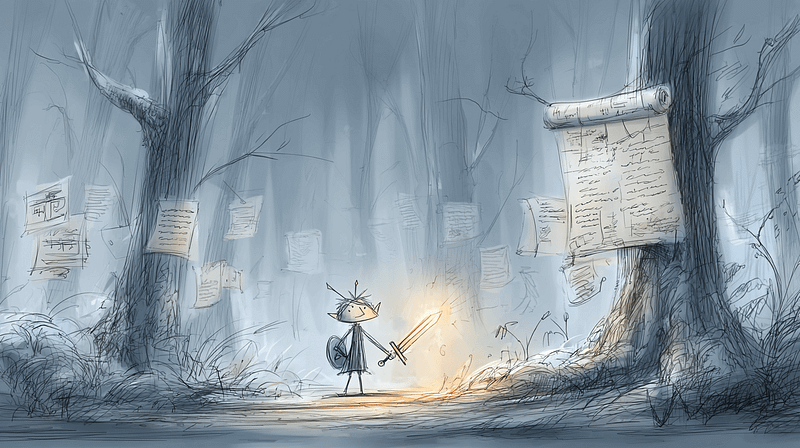

I wrote this article to highlight at least one of the reasons why **static code analysis** matters more than ever before, especially in an era of [vibe coding](https://tomaszs2.medium.com/what-is-vibe-coding-5511ff0c29ff) with AI agents.

As developers move faster and trust autocomplete more, the risk of subtle, compounding issues grows exponentially. Tools that automatically perform code quality analysis can help catch troublesome patterns early… before they snowball into serious technical debt.

### A name for the edges

Tolkien gave a name to the most notable weapons in The Lord of the Rings. That has always fascinated me. Aragorn’s sword was named Andúril; Thorin’s sword was named Orcrist; Frodo’s dagger was named Sting. A sword is double-edged, of course, but as far as I know, Tolkien never gave a different name to each of the two edges.

If I wrote a story about a fearless elven software developer on a quest in the wilderness of Middle Earth… then I would not name the sword. Instead, I’d name each of the double edges.

I would name them **Async** and **Await**.



There is little doubt (in my mind, at least) the [async](https://learn.microsoft.com/en-us/dotnet/csharp/language-reference/keywords/async) and [await](https://learn.microsoft.com/en-us/dotnet/csharp/language-reference/operators/await) keywords in the C# programming language are a double-edged sword: a blessing and a curse that can make your software run like a bat out of hell — or make you feel like you _are_ in hell, trying to dig your way out through miles of dirt and gravel with a plastic spoon… with that same bat duct-taped to the side of your head.

In an article I wrote years ago, I joked that [async/await is evil](https://www.linkedin.com/pulse/how-do-you-build-fast-lightweight-solution-cqrs-event-daniel-miller-ymjqc), and I am no less inclined to joke about it now. For those of us slinging serious code at serious problems, [asynchronous programming](https://learn.microsoft.com/en-us/dotnet/csharp/asynchronous-programming/async-scenarios) is a textbook example of a necessary evil.

> There are many great articles on the performance benefits of asynchronous code. Here is one that provides an excellent summary: [Optimizing Performance and Responsiveness with C#](https://medium.com/@robertdennyson/demystifying-async-await-in-c-net-8-optimizing-performance-and-responsiveness-b04f5e32d0d2)

If you are new to software development then you’ll notice the mystical keywords `async` and `await` littered everywhere, because the moment the async/await pattern is introduced into your codebase, those two words spread like a crazy-contagious virus.

And if you are anything like me, then you’ll learn the hard way: the spread of this particular virus is another necessary evil, because when you forget an await keyword somewhere that it’s expected (and you _will_ forget, believe me) you can spend hours trying to understand why your code suddenly starts behaving like a drunken schizophrenic.

### Allow me to demonstrate…

If you are unclear what I mean, then here is a bare-bones example:

```csharp
var simon = new Robot("Simon");
simon.Say("I have awaken.");
simon.Work();
simon.Say("I am returning to sleep.");

public class Robot(string name)
{
    public string Name { get; private set; } = name;

    public void Say(string something)
        => Console.WriteLine($"{DateTime.Now:HH:mm:ss} {Name} says: {something}");

    public async Task Work()
    {
        Say("I am starting an important task.");
        Say("Hold your breath until my work is complete.");
        await Task.Delay(3000);
        Say("My work is complete.");
        Say("You may breathe again.");
    }
}
```

This example is drop-dead simple, with only 21 lines of code, so it is easy to read and understand the intent. The output we expect (obviously) is this:

```
08:00:00 Simon says: I have awaken.
08:00:00 Simon says: I am starting an important task.
08:00:00 Simon says: Hold your breath until my work is complete.
08:00:03 Simon says: My work is complete.
08:00:03 Simon says: You may breathe again.
08:00:03 Simon says: I am returning to sleep.
```

Simon the robot wakes up and starts his work, you hold your breath for 3 seconds until he completes his work, then you resume breathing, and Simon returns to sleep.

However… this is not what happens...

Many of you astute readers spotted the mistake instantly, probably because it’s a painful mistake you’ve made as many times as I have. For those of you who did not spot the mistake, the actual output is surprising:

```
08:00:00 Simon says: I have awaken.
08:00:00 Simon says: I am starting an important task.
08:00:00 Simon says: Hold your breath until my work is complete.
08:00:00 Simon says: I am returning to sleep.
```

It looks like our robot Simon has gone AWOL. You don’t know if he finished his work; you don’t know if he encountered a problem with his important task; and if you follow his instructions then you’ll be holding your breath for a long, long time.

_Maybe_ he finished his work… Maybe he didn’t… Simon never says.

The mistake is tiny:

```csharp
simon.Work(); // <== The await operator is missing from the invocation here
```

If you execute this code using `dotnet run` and if you carefully read the output from dotnet then you’ll notice it _does_ offer a helpful hint on line 3: “Consider applying the ‘await’ operator to the result of the call.”

It is easy to miss this, and you’ll kick yourself when you do.

By default, the VS Code IDE shows a squiggly yellow line under the offending line of code, and if you hover over it, the tooltip reads: “Because this call is not awaited, execution of the current method continues before the call is completed.”

It is easy to miss this too, and you’ll kick yourself when you do.

Of course, you’ll catch this kind of mistake quickly enough in a project with only 21 lines of code. But if you’re working in a solution with thousands of lines of code, spanning dozens of projects and libraries, some written by you , some written by others , and some generated by a growing multitude of AI agents — then mistakes in asynchronous code can be fiendishly difficult to diagnose and debug.

> And just for the record: I **have** seen AI agents make this mistake.

### One simple solution

If you are using VS Code or Visual Studio then the simplest solution is to configure the built-in code analyzer warning [CS4014](https://learn.microsoft.com/en-us/dotnet/csharp/language-reference/compiler-messages/cs4014?f1url=%3FappId%3Droslyn%26k%3Dk%28CS4014%29) so it halts the compiler with an error message.

If you are working on a new project, or if you are working in a new environment, then this can be easy to forget, so make it a part of your standard checklist whenever you switch environments or start on a new project.

This simple solution is a good solution, and I recommend it.

If you want something a little different, or a little more, then .NET makes it quite easy to implement a code analyzer of your own.

### An alternative, more sophisticated solution

I wanted something more, so I worked with some friends and colleagues at [Shift iQ](http://www.shiftiq.com) to build a code analyzer that enforces a few specific coding rules. (Special thanks to [Oleg](https://github.com/oleg-terzi) and [Aleksey](https://github.com/aleksey-terzi) for their help on this.)

1.  Source code files must have one and only one top-level class declaration. This promotes better code organization and maintainability.
2.  Variable names with an “ID” suffix should use “Id” rather than “ID”. This promotes consistent naming conventions.
3.  Asynchronous method names must end with “Async”. This ensures asynchronous methods are clearly identifiable.
4.  Namespace declarations must match the folder structure, and must allow partial matches without necessarily requiring an exact match.
5.  Last, but not least, asynchronous methods must never be invoked without being awaited. This prevents potential issues with fire-and-forget async calls, like we’ve just seen.

### EyeSpy: A custom code analyzer

The [Roslyn](https://github.com/dotnet/roslyn) compiler makes it easy for C# developers to write your own custom code analyzers that integrates directly into your build pipeline.

The analyzer we developed is small and simple, and I named it **EyeSpy**, as a nod to the game we used to play as children.

> “I spy, with my little eye, something in your code that will make you miserable.”

It enforces only the five coding rules I listed above. The source is open and [published on GitHub](https://github.com/daniel-miller/eyespy), so you can dive into the code if you’re interested. Or you can fork the source and make whatever changes and improvements your heart so desires. Alternatively, if you don’t want to be bothered with any of that, you can just add the package to your project directly and run with it as is:

`dotnet add package EyeSpy`

I’ll use the rest of this article to provide more details.

---

### What is it?

EyeSpy is a small set of custom Roslyn-based analyzers for C# projects. It enforces a specific set of coding rules by generating a compile-time error when the rules are broken. The rules are designed to be pragmatic and opinionated, suitable for use in both greenfield and legacy projects.

### Why does it matter?

The rationale is straightforward enough. I want to:

-   Promote clear and consistent naming conventions
-   Avoid mistakes in async programming practices
-   Align namespace hierarchies and folder structures

### What are the rules?

Version 1.0.5 enforces five distinct rules. The naming convention for these rules is `SPYXX`, where XX is a unique number assigned to the rule. (I don’t expect we’ll need more than 99 analyzers in the foreseeable future, but we can easily update the convention if needed.)

### SPY01: One top-level class per file

This rule ensures that each C# source code file contains one top-level class declaration. Placing multiple classes in a single file often leads to maintainability issues and violates widely accepted conventions for file organization, and this rule safeguards against all that.

#### Examples

```csharp
public class FirstClass { }
public class SecondClass { } // ❌ Move SecondClass to a separate file 
```

Limiting files to one class improves traceability and version control diffs, particularly in large teams and open-source projects.

### SPY02: Disallow “ID” as an identifier name suffix

This rule enforces a .NET-recommended naming convention by requiring the replacement of uppercase “ID” suffixes with the more idiomatic Pascal Case “Id”.

#### Examples

```csharp
public int UserID { get; set; }        // ❌ Should be UserId
private string customerID;             // ❌ Should be customerId
void ProcessOrder(int orderID) { }     // ❌ Should be orderId
```

This is purely cosmetic, of course, but consistent casing always improves readability and aligns with .NET design guidelines. This is especially valuable when working with shared APIs, domain models, and libraries.

### SPY03: Async method naming

Async method names must end with the `Async` suffix. This is a standard convention that clearly signals to developers they are invoking asynchronous code.

#### Examples

```csharp
public async Task ProcessData() { }      // ❌ Should be ProcessDataAsync
public async Task<string> GetUser() { }  // ❌ Should be GetUserAsync
```

This helps avoid confusion when invoking async methods, especially if sync and async calls are intermixed.

### SPY04: Namespace-folder alignment

When you are navigating a large codebase, it’s essential to have consistency between a namespace and the folder structure in which its class files are organized. This rule requires namespace declarations that aligns to the directory structure.

#### Examples

```csharp
// Assume file path C:\Projects\MyApp\Controllers\Api\UserController.cs
namespace MyApp.Controllers.Api  // ✅ Valid
namespace MyApp.Controllers      // ✅ Valid
namespace MyApp                  // ✅ Valid
namespace Controllers.Api        // ❌ Missing project name as root
namespace Foo.Bar                // ❌ Entirely mismatched
namespace MyApp.Services         // ❌ Diverges from folder structure
```

This alignment encourages predictable project layout and reduces friction for developers navigating code for the first time (and for developers navigating old code for the first time in a long time).

VS Code and Visual Studio provide support for a similar rule in [IDE0130](https://learn.microsoft.com/en-us/dotnet/fundamentals/code-analysis/style-rules/ide0130), but I find Microsoft’s implementation here too strict. I prefer to allow some flexibility, so that shallow namespaces are permitted for deeper folder structures.

### SPY05: Async calls must be awaited

Un-awaited async calls are a frequent source of nasty bugs, especially when a task is silently dropped or exception-handling behavior is not triggered. This rule identifies `async` method calls that are missing the `await` keyword.

#### Example

```csharp
public async Task ProcessDataAsync()
{
    WorkAsync();               // ❌ Should be: await WorkAsync();
    var result = WorkAsync();  // ❌ Should be: var result = await WorkAsync();
}
```

This rule helps catch fire-and-forget errors and makes async flows more transparent.

---

### Installation options

EyeSpy supports multiple integration approaches depending on your project setup and build preferences.

#### 1\. NuGet package

Add it as a package reference to your `.csproj` project file.

```xml
<PackageReference Include="EyeSpy" Version="1.0.5" />
```

This ensures analyzers are available during build and analysis phases, without polluting the runtime.

#### 2\. Project reference

Add the project directly to your solution for local development:

```xml
<ProjectReference Include="path/to/EyeSpy.csproj">
  <OutputItemType>Analyzer</OutputItemType>
</ProjectReference>
```

#### 3\. Analyzer reference

When using the compiled `.dll` you can include the analyzer directly:

```xml
<Analyzer Include="path/to/EyeSpy.dll" />
```

This option is useful for build pipelines or custom tooling scenarios.

---

### Configuration and suppression

You can configure or suppress diagnostics for individual rules as needed.

#### .editorconfig

Disable or demote specific analyzers:

```editorconfig
[*.cs]
dotnet_diagnostic.SPY01.severity = none       # Disable file structure rule
dotnet_diagnostic.SPY02.severity = suggestion # Make casing a suggestion
```

#### Project file

Suppress multiple warnings in bulk:

```xml
<PropertyGroup>
  <NoWarn>$(NoWarn);SPY01;SPY02</NoWarn>
</PropertyGroup>
```

#### Pragma directives

Suppress diagnostics around a specific block of code:

```csharp
#pragma warning disable SPY01
public class FirstClass { }
public class SecondClass { } // No error
#pragma warning restore SPY01
```

### Platform requirements

Ensure your project targets at least:

-   .NET Standard 2.0
-   Microsoft.CodeAnalysis.CSharp 4.14.0
-   Microsoft.CodeAnalysis.Analyzers 4.14.0

These dependencies ensure compatibility with modern tooling while remaining accessible to legacy projects.

We use this library in our .NET Standard projects, our .NET (Core) projects, and our .NET Framework projects.

---

### Closing thoughts

EyeSpy is intended to be a clean and clear demonstration of static code analysis in C#. It shows how coding conventions can be enforced without overwhelming developers with a lot of noise and complexity.

By enforcing a carefully curated set of high-impact rules at compile time, a tool like this can really improve the maintainability, readability, and correctness of a codebase.

“Fail Fast” is a great philosophy in software development. If there’s a mistake (or a potential mistake) in your code, then you want a flashing neon sign over it as early as possible — before it can slink off into the dark and hide… where it’s apt to wait until the least opportune time to leap out and sink its teeth into your backside.

If you have read all the way to this point, then it’s a sure sign you care about the quality of your code as much as I do about mine — so I’d be interested in your thoughts on the article and on the project.

Check it out! [https://github.com/daniel-miller/eyespy](https://github.com/daniel-miller/eyespy)


---

This article was originally posted on Medium: [https://medium.com/@daniel-miller/build-your-own-csharp-code-analyzer-0c3cd23f5dbf](https://medium.com/@daniel-miller/build-your-own-csharp-code-analyzer-0c3cd23f5dbf)
