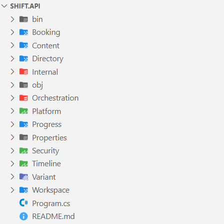

You can add a little semantic organization to the folders in a large [VS Code](https://code.visualstudio.com/docs) project directory without nesting them into subfolders. It’s easy to do with a little color-coding, and it’s a strategy that works nicely even if you have a bit of color-blindness, thanks to the iconography in the [Material UI](https://mui.com/material-ui/material-icons/).

Every software system architect has been in the same place: staring at a long list of identically-styled folders in the Explorer, trying to mentally parse which directories contain domain logic versus infrastructure code, or distinguishing between test assemblies and production modules.

Of course, the traditional approach to solving this problem quickly leads down the rabbit hole of a deeply nested folder structure. That can become unwieldy in a hurry, but even more problematic than that: it requires one (and only one) answer to the many questions about how to decide the hierarchical structure.

Alternatively, a less traditional approach can leave the project directory exactly as it is, and use the [Material Icon Theme](https://marketplace.visualstudio.com/items?itemName=PKief.material-icon-theme) extension to encode semantic meaning directly into the appearance of each folder in that directory. This permits a flatter structure while preserving important architectural metadata at a glance.

### Why flatten your folder structure?

Before diving into implementation, let’s establish why this approach matters for enterprise development:

Reduced Cognitive Load: Senior developers spend significant time navigating codebases. Visual cues eliminate the mental overhead of remembering what each folder contains.

Architectural Clarity: Color coding can represent architectural layers (presentation, application, domain, infrastructure) without forcing artificial nesting that doesn’t align with your assembly structure.

Team Consistency: When the entire team uses the same visual language, onboarding can be a little easier, and code reviews can be a little more efficient.

Build Performance: Flatter structures result in shorter file paths, which can improve build times in large solutions.

### Configuration Steps

#### Prerequisites

Ensure you have the Material Icon Theme extension installed:

1.  Open VS Code
2.  Navigate to Extensions (Ctrl+Shift+X)
3.  Search for “Material Icon Theme” by Philipp Kief
4.  Install and set as your file icon theme

#### Step 1: Access your settings

Open your VS Code settings.json file:

-   Press Ctrl+Shift+P (Windows/Linux) or Cmd+Shift+P (Mac)
-   Type “Preferences: Open Settings (JSON)”
-   Select the option to open your user settings.json

#### Step 2: Configure folder associations

Here’s a real-world example from [Shift iQ](https://www.shiftiq.com/), one of the enterprise applications I helped to design. This example demonstrates component type organization without traditional nested structures:

{  
"material-icon-theme.folders.associations": {  
  
"bin": "Batch",  
"obj": "Batch",  
"Properties": "Batch",  
  
"System": "Scala",  
"Orchestration": "Scala",  
"Internal": "Scala",  
  
"Feature": "Project",  
"Assessment": "Project",  
"Billing": "Project",  
"Booking": "Project",  
"Competency": "Project",  
"Content": "Project",  
"Directory": "Project",  
"Feedback": "Project",  
"Job": "Project",  
"Learning": "Project",  
"Location": "Project",  
"Messaging": "Project",  
"Progress": "Project",  
"Reporting": "Project",  
"Workflow": "Project",  
"Workspace": "Project",  
  
"Plugin": "Middleware",  
"Integration": "Middleware",  
"Variant": "Middleware",  
  
"Utility": "Drizzle",  
"Metadata": "Drizzle",  
"Platform": "Drizzle",  
"Security": "Drizzle",  
"Timeline": "Drizzle"  
}  
}

This configuration demonstrates a specific component classification system:

**Build Artifacts** (Batch icons in grey): Standard .NET build outputs that can be safely ignored during development.

**System Components** (Scala icons in red): Core system-level functionality including orchestration services and internal helpers.

**Feature Modules** (Project icons in blue): Business domain features that are organized into independent modules. Rather than creating a “Features” parent folder, each platform feature (Assessment, Billing, Booking, etc.) stands as a peer. You’ll notice this lends itself very well to [vertical slice architecture](https://www.milanjovanovic.tech/blog/vertical-slice-architecture) patterns.

**Integration Layer** (Middleware icons in purple): Components that handle external integrations and custom variants. These typically handle the interoperation between features and external systems.

**Utility Services** (Drizzle icons in green): Cross-cutting concerns and platform utilities that support multiple features without belonging to any specific domain.

Here’s an excerpt to show how it looks in the VS Code Explorer:

#### Step 3: Understanding the component classification strategy

This approach eliminates the need for traditional component-type parent folders like “Features/”, “Utilities/”, or “Plugins/”. Instead of a structure like:

├── Features/  
│ ├── Billing/  
│ ├── Booking/  
│ └── Assessment/  
├── Utilities/  
│ ├── Security/  
│ └── Platform/  
└── Plugins/  
└── Integration/

You achieve the same semantic organization with a flat structure:

├── Billing/ (blue project icon)  
├── Booking/ (blue project icon)  
├── Assessment/ (blue project icon)  
├── Security/ (green drizzle icon)  
├── Platform/ (green drizzle icon)  
└── Integration/ (purple middleware icon)

The visual encoding preserves the same architectural information with smaller and simpler paths, which improves discoverability. (“Discoverability” is a term you’ll see a lot in API documentation; it’s especially important in web API libraries and open-source platforms.) A developer who is new to the project can immediately distinguish between feature modules, utility services, and integration components without having to mentally parse folder hierarchies.

#### Step 4: Customize for your architecture

The beauty of this approach lies in its flexibility. Adapt the associations to match your specific architectural patterns:

For Clean Architecture projects:

"Core": "core",  
"UseCases": "command",  
"Gateways": "interface",  
"Adapters": "connection"

For Domain Driven Design projects:

"Aggregates": "cluster",  
"ValueObjects": "class",  
"DomainServices": "functions",  
"Specifications": "rules"

For microservice projects:

"ApiGateways": "router",  
"EventHandlers": "event",  
"MessageBrokers": "queue",  
"HealthChecks": "health"

#### Advanced semantic encoding

Beyond basic folder types, you can encode additional metadata. For example, you might decide to encode priority levels:

-   Critical components: “Auth”: “secure”
-   Performance-sensitive: “Cache”: “temp”
-   Legacy code: “Legacy”: “archive”

… or team ownership:

-   “Frontend”: “public”
-   “Backend”: “private”
-   “DevOps”: “tools”

… or environment-specificity:

-   “Development”: “environment”
-   “Staging”: “staging”
-   “Production”: “dist”

### A few recommendations to get started

There are a few things to keep in mind.

**Establish team standards**. Document your conventions in a README at the directory root. Consistency is important for this approach to provide value.

**Start gradually**. Begin with high-level architectural distinctions before diving into granular categorizations. Too many associations could become counterproductive.

**Review regularly**: As your codebase evolves, revisit and refine your folder associations. What made sense six months ago might need adjustment.

### In closing…

Applying iconography to the folders of a large project in VS Code is a small investment with some (potentially) big returns — especially for senior software development teams. By encoding architectural semantics directly into the visual presentation of your IDE, you can eliminate a little cognitive overhead while maintaining clean, flat project structures that align well with modern development practices.

The key is to treat folder icons/colors as architectural documentation that lives alongside your code, evolving with your system’s complexity while keeping navigation intuitive and efficient.

Start with a basic configuration, then refine it over time to match the patterns and conventions that make sense for your project and your team. Your future self — and your teammates — will appreciate the added clarity.

#VSCode #SoftwareArchitecture #DeveloperExperience #CleanArchitecture #CognitiveLoad #DevTeamProductivity

---

This article was originally posted on Medium: [https://medium.com/@daniel-miller/color-coding-folders-in-vs-code-45006fb32473](https://medium.com/@daniel-miller/color-coding-folders-in-vs-code-45006fb32473)
