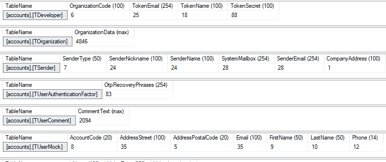

Whenever I inherit a database from another developer, I always start by analyzing its size and schema to identify any immediate quick wins to improve its performance - and/or decrease its drag on the underlying server infrastructure.

For example, I remember one database in particular that contained about 8 million rows in 22 tables. Despite the large number of rows, the data was entirely plain text (English and French only), and the number of columns per table was relatively small, so the amount space the database occupied on the disk surprised me: more than 6 GB.

After further analysis, I discovered the developer had used the `NVARCHAR` data type for every text column in every table.

`NVARCHAR` is a Unicode, variable-length character data type, which requires 2 bytes per character. This data type isn't needed for storing English or French plain text, because both languages are fully supported by the standard `VARCHAR` data type.

`VARCHAR` is a non-Unicode, variable-length character data type, which requires 1 byte per character.

In other words, using `VARCHAR` rather than `NVARCHAR` saves storage space and improves performance without any downside in this usage scenario. The `NVARCHAR` data type is designed to store a wide range of global characters, such as Chinese or Arabic, which require Unicode. Since English and French use standard Latin characters, there is no need for the extra overhead of Unicode.

Put simply, I decreased the size of every database table by more than 50% simply by converting the data type for all `NVARCHAR` columns to `VARCHAR`. This improved disk utilization by a factor of more than 2X.

At the same time, it was an ideal opportunity to adjust the size of every `VARCHAR` column so its maximum length more closely matched the size of the largest text value it contained. This does not contribute to decreasing the size of the database, but it does bring the schema into closer alignment with the actual data that it stores, and this can lead to query performance improvements in SQL Server. (In the future I will post a separate article on this topic.)

To determine an appropriate size for every text column in every database table, I needed a T-SQL query to list the tables and calculate `MAX(LEN())` for every `VARCHAR` column. I could not find anything to do exactly what I wanted, so I wrote a query that turned out to do the job nicely.

## Using the code

The SQL query looks like this:

```sql
DECLARE @TableName NVARCHAR(100);

DECLARE X CURSOR READ_ONLY LOCAL FOR
  SELECT '[' + TABLE_SCHEMA + '].[' + TABLE_NAME + ']'
  FROM INFORMATION_SCHEMA.TABLES
  WHERE TABLE_TYPE = 'BASE TABLE'
    AND TABLE_SCHEMA = 'accounts'
  ORDER BY TABLE_SCHEMA, TABLE_NAME;

OPEN X;
FETCH FROM X INTO @TableName;

WHILE @@FETCH_STATUS = 0
BEGIN
  DECLARE @Query NVARCHAR(MAX);

  SELECT @Query = N'SELECT ''' + @TableName + N''' as TableName, ' +
    STUFF((
      SELECT
        ', MAX(LEN([' + COLUMN_NAME + '])) as [' + COLUMN_NAME + 
        ' (' +
        CASE
          WHEN CHARACTER_MAXIMUM_LENGTH = -1 THEN 'max'
          ELSE CAST(CHARACTER_MAXIMUM_LENGTH AS VARCHAR(10))
        END + ')]'
      FROM INFORMATION_SCHEMA.COLUMNS
      WHERE DATA_TYPE IN ('nvarchar', 'varchar')
        AND '[' + TABLE_SCHEMA + '].[' + TABLE_NAME + ']' = @TableName
      FOR XML PATH('')
    ), 1, 1, '') +
    N' FROM ' + @TableName
  FROM INFORMATION_SCHEMA.COLUMNS
  WHERE DATA_TYPE IN ('nvarchar', 'varchar');

  EXEC sp_executesql @sql = @Query;

  FETCH NEXT FROM X INTO @TableName;
END;

CLOSE X;
DEALLOCATE X;
```

Executing the query returns a result that looks like this:



The output isn't beautiful, but it provides all the information I needed. At one glance, I can see the maximum length of the actual values in every column in every table for the entire database. I can also see the maximum character length already defined for each column: this appears in brackets beside the column name.

Then, I can adjust the size of each column as (if) needed:

```sql
-- Resize the column, leaving extra space for future outliers.
ALTER TABLE accounts.TDeveloper
ALTER COLUMN OrganizationCode VARCHAR(10)
```

## Points of interest

I don't see the [STUFF](https://msdn.microsoft.com/en-us/library/ms188043.aspx) function very frequently, so it did not occur to me initially. This function inserts a string into another string by deleting a specified length of characters in the first string at the start position, and then inserting the second string into the first string at the start position. This can be handy for string-manipulation, especially when we want to generate a dynamic SQL statement that hits the database only once per table.

Additional steps to reduce the size of the database included rebuilding the indexes on all tables, and shrinking the database with [DBCC](https://learn.microsoft.com/en-us/sql/t-sql/database-console-commands/dbcc-transact-sql).

At the end of the day, the size of the database was less than 1.5 GB, for an overall reduction of more 75 percent!

---

This article originally appeared on CodeProject:  
[How to calculate the length of the largest text value in every table column](https://www.codeproject.com/Tips/1042832/How-to-Calculate-the-Length-of-the-Largest-Text-Va)
