## Preamble

I published this article for [Code Project](https://www.codeproject.com/) in 2020. It's tough to believe five years have passed since then. I guess time flies when you're having fun...

The Code Project site has been in a state of flux for the past several months, and I don't know when (or if) it will return to normal operation again. Sites like Code Project and [Stack Overflow](https://stackoverflow.com/) seem to be struggling to gain a toe-hold in the sheet of glass that AI and Large Language Models have paved over the entire Q&A landscape. In case Code Project goes dark, I decided to re-publish the original article here on LinkedIn. Five years is an eon in the software industry, but the content here stands the test of time quite well — so far, at least!

The source code for the article is available here [https://github.com/daniel-miller/timeline](https://github.com/daniel-miller/timeline)

---

## Introduction

If you are reading this article, then you probably already know something about Command Query Responsibility Segregation ([CQRS](https://learn.microsoft.com/en-us/azure/architecture/patterns/cqrs)) and Event Sourcing ([ES](https://learn.microsoft.com/en-us/azure/architecture/patterns/event-sourcing)). There is some very good material available online, if you are looking for background information. For example:

-   [CQRS in Practice](https://www.pluralsight.com/courses/cqrs-in-practice)
-   [CQRS by Martin Fowler](https://martinfowler.com/bliki/CQRS.html)
-   [Event Sourcing Pattern (](https://microservices.io/patterns/data/event-sourcing.html)[Microservices.io](http://microservices.io/)[)](https://microservices.io/patterns/data/event-sourcing.html) or [Event Sourcing Pattern (](https://docs.microsoft.com/en-us/azure/architecture/patterns/event-sourcing)[Microsoft.com](http://microsoft.com/)[)](https://docs.microsoft.com/en-us/azure/architecture/patterns/event-sourcing)
-   [Event Sourcing: The Good, the Bad, and the Ugly](https://www.continuousimprover.com/2017/11/event-sourcing-good-bad-and-ugly.html)
-   [What They Don't Tell You About Event Sourcing](https://medium.com/@hugo.oliveira.rocha/what-they-dont-tell-you-about-event-sourcing-6afc23c69e9a)

In my view, the key benefits of CQRS+ES are these:

-   Data is never modified or deleted.
-   The change/audit log for your system has perfect integrity.
-   It enables rollbacks and other time-based features, such as running analyses on previous states.
-   It can improve application performance and scalability - at least, in theory!
-   It can also (in theory) improve code quality and testability.

In this article I won't explain the rationale behind CQRS+ES in any more detail than that, and I won't dive into reasons why you might want to use it (or avoid it).

The purpose of this article is to present the pattern for a fast and lightweight implementation using the C# programming language and the .NET Framework.

This implementation is very simple, but still relatively full-featured, including support for SQL Server persistence of commands and events, scheduled commands, snapshots, sagas (i.e., process managers), and plug-and-play overrides for multitenant customization.

I will describe how the code is structured and illustrate how it works with a sample program that follows Clean Architecture principles.

Please note: I do not expect (or recommend) that you take this source code and incorporate it directly into any software system you are developing. This "implementation" is only a prototype, intended to illustrate one potential application for a theoretical pattern; it is not intended to serve as a reusable library or finished product - and the code is not suitable for integration into any live, production system.

## Why Bother?

This is almost certain to be your first question.

If you are researching options and evaluating alternatives to make a build-vs-buy decision for a CQRS+ES solution, then there are some existing commercial and open-source products to consider. For example:

-   [Event Store](https://eventstore.com/)
-   [EventFlow](http://geteventflow.net/)
-   [CQRSlite](https://github.com/gautema/CQRSlite)
-   [SimpleCQRS](https://github.com/tyronegroves/SimpleCQRS)

Why implement a solution when those options are available? Why start from scratch and develop your own?

I have studied CQRS and ES patterns for several years now. I have worked with some commercial and open-source solutions, and I have used them to build and/or improve real-world production systems. If your background and experience is similar to mine, then you probably know the answer to this question already, but you might not want to believe it's true (as I did not for a long time):

**If you are serious about adopting a CQRS+ES architecture, then you might have no choice except to build your own.**

As Chris Kiehl says in his article, "[Event Sourcing is Hard](https://chriskiehl.com/article/event-sourcing-is-hard)":

> _... you're probably going to be building the core components from scratch. Frameworks in this area tend to be heavyweight, overly prescriptive, and inflexible in terms of tech stacks. If you want to get something up and running ... then rolling your own is the way to go (_[_and a suggested approach_](https://youtu.be/LDW0QWie21s?t=1926)_)._

If that's the case, then how does it help you for me to write this article?

Simple: It's another example, with source code, so you can see my approach to solving some of the problems that arise in a CQRS+ES implementation. If you are starting out on your first CQRS+ES project, then you should study all the examples you can find.

My intent is to provide such an example, from which you can draw ideas - and perhaps (if I do a decent job of this) some small inspiration - for your own project.

## Priorities

It is important to begin with a list of the priorities driving this implementation, because there are significant trade-offs to many of the design decisions I have made.

CQRS+ES purists will object to some of my decisions, and flatly condemn others. I can live with that. I have been designing and developing software for a long time (longer than I am prepared to admit here). I have shed more than a little blood, sweat, and tears - and a few gray hairs too - so I am acutely aware of the cost associated with a poor choice in the face of a trade-off.

The following priorities help to inform and guide those decisions. They are listed in rough order of importance, but _all_ are requirements, so pour yourself a drink and settle in, because the preamble here is going to be a long one...

### 1\. Readability

The code must be _readable_.

The more readable the code, the more usable and maintainable and extensible it is.

In some implementations I have used (and in some I have developed myself), the code for the underlying CQRS+ES backbone is virtually impossible for anyone to understand except the original author. We cannot allow that here. It must be possible - and relatively easy - for a small team of developers to share and use the code, with a full understanding of how it works and why it is written in the way that it is.

It is especially important to keep the code for registering command handlers and event handlers as simple and explicit as possible.

Many CQRS+ES frameworks use a mix of reflection and dependency injection to automate the registration of subscribers for handling commands and events. While this is often very clever, and often decreases the overall number of lines of code in the project, it hides the relationships between a command (or an event) and its subscriber(s), moving those relationships into an opaque, magical black-box. Many inversion-of-control (IoC) containers make this easy to do, hence the understandable temptation, but I believe it's a mistake.

To be clear: it is not a mistake to use an IoC container in your project. Dependency injection is an excellent best practice and an important technique to perfect. However, the [dependency injection pattern](https://en.wikipedia.org/wiki/Dependency_injection) is not itself a [publish-subscribe pattern](https://en.wikipedia.org/wiki/Publish%E2%80%93subscribe_pattern), and conflating the two can lead to a lot of misery and woe. It is a mistake (I have made myself) to use highly specialized features in an IoC container library to automate functionality that is on the outside edge of that library's intended purpose, and then tightly couple the most critical components in your software architecture to that. When something in your application behaves unexpectedly, this can make it extraordinarily difficult and time-consuming to troubleshoot and debug.

Therefore, as part of this readability goal, the registration of command handlers and event handlers must be defined _explicitly_ in the code, and not _implicitly_ via convention or automation.

### 2\. Performance

The code must be _fast_.

Handling commands and events is at the heart of any system developed on a CQRS+ES architecture, so throughput optimization is a key performance indicator.

The implementation must handle the maximum possible volume, in terms of concurrent users and systems issuing commands and observing the effect of published events.

In some of my previous implementations, a lot of pain and suffering was caused by concurrency violations that occurred when commands were sent to large aggregates (e.g., long-lived aggregates with massive event streams). More often than not, the root cause was poor-performing code. Therefore algorithm optimization is critical.

Snapshots are integral to satisfying this requirement, therefore must be integral to the solution. The implementation must have built-in support for automated snapshots on every aggregate root.

In-memory cache is another important part of run-time optimization, therefore must be integral to the solution as well.

### 3\. Debuggability

It must be easy to trace the code and follow its execution using a standard debugger like the Visual Studio IDE debugger.

Many CQRS+ES implementations seem to rely on complex algorithms for dynamic registration, lookup, and invocation of methods for handling commands and events.

Again, many of these algorithms are extremely clever: they pack a lot of power and flexibility, and can significantly decrease the number of lines of code in the solution.

For example, I have used a [DynamicInvoker](https://gist.github.com/Daniel-Miller/902a7b435a7409941696c07eb5dd87e1) class in some of my own past projects. It's an ingenious bit of code - less than 150 lines - and it works beautifully. (I didn't write it, so I'm not boasting when I say that.) However, if something goes haywire in code you've written that calls methods on this kind of class, and if you need to step through it with a debugger, then you'll need to be especially adept at the mental gymnastics required to follow what's going on. I am not, so if any dynamic invocation is used, then it must be trivially easy to understand the code and follow the thread of its execution when using a debugger.

### 4\. Minimal Dependencies

External dependencies must be kept to an absolute bare-metal minimum.

Too many dependencies lead to code that is slower, heavier, and more brittle than you are likely to want in any critical components of your system. Minimizing dependencies helps to ensure your code is faster, lighter, and more robust.

Most important, minimizing dependencies helps to ensure the solution is not tightly coupled with any external assembly, service, or component unless that dependency is critical.

If the fundamental architecture of your software is dependent upon some external third-party component, then you must be prepared for the potential that changes to it might someday have an impact on your project. Sometimes this is an acceptable risk, other times it is not.

In this particular implementation, tolerance for this risk is very, very low.

Therefore, you will notice the core Timeline assembly (which implements the CQRS+ES backbone in my solution) has one and only one external dependency: i.e., the System namespace in the .NET Framework.

> Just a quick aside here, because it is an interesting article that illustrates my point: At the time [this article](https://www.techrepublic.com/article/why-its-finally-time-for-developers-to-address-the-chaos-of-node-js-and-npm/) was written in 2018, the NPM JavaScript package "is-odd" had over 2.8 million installations in a single week. Rather than write the basic code for a function to return true if a number is odd, all those developers chose to incorporate the is-odd package into their solutions, along with its chain of 300+ dependencies!

### 5\. Separate Commands and Events

Many CQRS+ES frameworks implement a Command class and an Event class in such a way that both derive from a common base class.

The rationale for this is obvious: it is natural to think of both Commands and Events as subtypes of a general-purpose Message. Both are "sent" using some form of "service bus", so why not implement common features in a shared base class, and write one dual-purpose class for routing messages - rather than write a lot of duplicate code?

This is an approach I have taken in the past, and there are good arguments for it.

However, I now believe it might be a mistake. To quote [Robert C. Martin](https://www.informit.com/authors/bio/361a5e70-f1e2-432b-9928-b30b4742ae80):

> Software developers often fall into a trap - a trap that hinges on their fear of duplication. Duplication is generally a bad thing in software. But there are different kinds of duplication. There is true duplication, in which every change to one instance necessitates the same change to every duplicate of that instance. Then there is false or accidental duplication. If two apparently duplicated sections of code evolve along different paths - if they change at different rates, and for different reasons - then they are not true duplicates... When you are vertically separating use cases from one another, you will run into this issue, and your temptation will be to couple the use cases because they have similar user interfaces, or similar algorithms, or similar database schemas. Be careful. Resist the temptation to commit the sin of knee-jerk elimination of duplication. Make sure the duplication is real.

Commands and events are sufficiently different from one another to warrant separate paths along which they can evolve and adapt to the requirements of your system.

I have not (yet) experienced any scenario in which code quality, performance, or readability is improved by eliminating "duplicate" code for A) sending/handling commands, and B) publishing/handling events.

Therefore commands and events must **not** have any shared base class, and the mechanism used to send/publish commands/events must **not** be a shared queue.

### 6\. Multitenancy

Multitenancy must be integral to the solution, and not a feature or facility that is bolted on after-the-fact.

These days I build and maintain enterprise, multitenant systems exclusively. That means I have a single instance of a single application serving multiple concurrent tenants with multiple concurrent users.

There are several reasons for making multitenancy a priority in this implementation:

-   Every aggregate must be assigned to a tenant. This makes ownership of data clear and well-defined.
-   Sharding must be easy to implement when the need arises to scale up. Sharding is the distribution of aggregates to multiple write-side nodes, and "tenant" is the most natural boundary along which to partition aggregates.
-   Tenant-specific customizations must be easy to implement. Every application has core default behavior for every command and every event, but in a large and complex application that serves many different organizations and/or stakeholders, different tenants are certain to have a variety of specific needs. Sometimes the differences are slight; sometimes they are significant. The solution here must allow the developer to override the default handling of a command and/or event with functionality that is custom to a specific tenant. Overrides must be explicit, so they are easy to identify and enable or disable.

### 7\. Sagas / Process Managers

The number of steps required to implement a process manager must be relatively small, and the code for a process manager must be relatively easy to write.

A process manager (sometimes called a saga) is an independent component that reacts to domain events in a cross-aggregate, eventually consistent manner. A process manager is sometimes purely reactive, and sometimes represents a workflow.

> From a technical perspective, a process manager is a state machine driven forward by incoming events, which might be published from multiple aggregates. Each state can have side effects (e.g., sending commands, communicating with external web services, sending emails).

I have worked with some CQRS+ES frameworks that do not support process managers at all, and others that support the concept but not in a way that is easy to understand or configure.

> For example, in one of my own past implementations, an event was published _by the event store_ immediately after the event was appended to the database log. It was not published by the aggregate or by the command handler. This made it unusually difficult to implement even the most basic workflow: I could not send a synchronous command to an aggregate from within an event handler, because the event store's Save method executed inside a synchronization lock (to maintain thread-safety), and new events could not be published without creating a deadlock.

Regardless of how simple or complex the state-machine for a workflow happens to be, coordinating the events in that process requires code that has side effects, such as sending commands to other aggregates, sending requests to external web services, or sending emails. Therefore, the solution here must have native, built-in support for achieving this.

### 8\. Scheduling

The scheduling of commands must be integral to the solution.

It must be easy to send a command with a timer, so the command executes only after the timer elapses. This enables the developer to indicate a specific date and time for the execution of any command.

This is useful for commands that must be triggered on a time-dependency.

It is also useful for commands that must be executed "offline", in a background process outside the normal flow of execution. This type of totally asynchronous operation is ideal for a command that is expected to require a long time to complete.

> For example, suppose you have a command that requires the invocation of a method on some external third-party web service, and suppose that service often takes more than 800,000 milliseconds to respond. Such a command must be scheduled to execute during off-peak hours, and/or outside the main thread of execution.

### 9\. Aggregate Expiration

The solution must have native, built-in support for aggregate expiration and cleanup.

I need a CQRS+ES solution that makes it easy to copy an aggregate event stream from the online structured log to offline storage, and purge it from the event store.

> Event sourcing purists will red-flag this immediately and say the event stream for an aggregate must never be altered or removed. They'll say that events (and therefore aggregates) are immutable by definition.

However, I have scenarios in which this is a non-negotiable business requirement.

-   First: When a customer does not renew their subscription to a multitenant application, the service provider hosting the application often has a contractual obligation to remove that customer's data from its systems.
-   Second: When a project team runs frequent integration tests to confirm system functions are operating correctly, the data input to and output from those tests is temporary by definition. Permanent storage of the event streams for test aggregates is a waste of disk space with no current or future business value; we need a mechanism for removing it.

Therefore, the solution here must provide an easy way to move aggregates out of the operational system and into "cold storage", so to speak.

### 10\. Async/Await is Evil

I am joking, of course.

But not really.

The [async/await](https://docs.microsoft.com/en-us/dotnet/csharp/programming-guide/concepts/async/) pattern in C# produces _very_ high-performance code. There is no question about this. In some cases, I have seen it boost performance by an order of magnitude or more.

The async/await pattern may be applied in a future iteration of this solution, but - despite the second priority in this list - it is disallowed in this solution, because it breaks the first priority.

As soon as you introduce async/await into a method, you are forced to transform its callers so they use async/await (or you are forced to start wrapping clean code in dirty threading blocks), and then you are forced to transform the callers of those callers so they use async/await... and the async/await keywords spread throughout your entire code base like a contagious zombie virus. The resulting asynchronous mess is almost certain to be faster, but at the same time much more difficult to read, and even more difficult to debug.

Readability is the highest priority here, therefore I am avoiding async/await until it is the only remaining option for boosting performance (and that added boost is itself a non-negotiable business requirement).

## Clean Architecture

[Matthew Renze](https://github.com/matthewrenze) has an excellent [Pluralsight course](https://www.pluralsight.com/courses/clean-architecture-patterns-practices-principles) on the topic of clean architecture. The source code for this solution contains five assemblies and it follows the clean architecture pattern that he advocates. This is overkill for a sample application, obviously, but it helps to establish the pattern that the larger enterprise implementation needs to follow.

### Timeline Project

The Timeline assembly implements the CQRS+ES backbone. This assembly has no upstream dependencies, and therefore it is not specific to any application. It can be unplugged from the sample application and integrated into a new solution to develop an entirely different application.

The other four assemblies (_Sample.\*_) implement the layers in a console application using the Timeline assembly to demonstrate my approach to common programming tasks in a CQRS+ES software system.

The project dependency diagram is illustrated here:

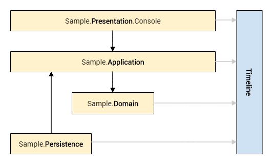

### Sample Projects

Notice the Timeline assembly has no references to any Sample assembly.

Also notice the domain-centric approach: the Domain layer has no dependencies on the Presentation, Application, or Persistence layers.

The entity relationship diagram for the sample domain is illustrated in Figure 2:

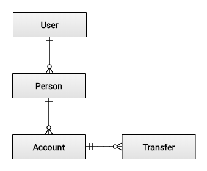

In this basic data model:

-   a Person had 0..N bank Accounts;
-   a Transfer withdraws money from one account and deposits it in another account;
-   a User may be an administrator with no personal data, or someone with personal data owned by multiple tenants

Keep in mind: every Person, Account, and Transfer is an aggregate root, therefore each of these entities has a Tenant attribute.

### Overview

The overall approach to CQRS+ES in this solution is illustrated in Figure 3:

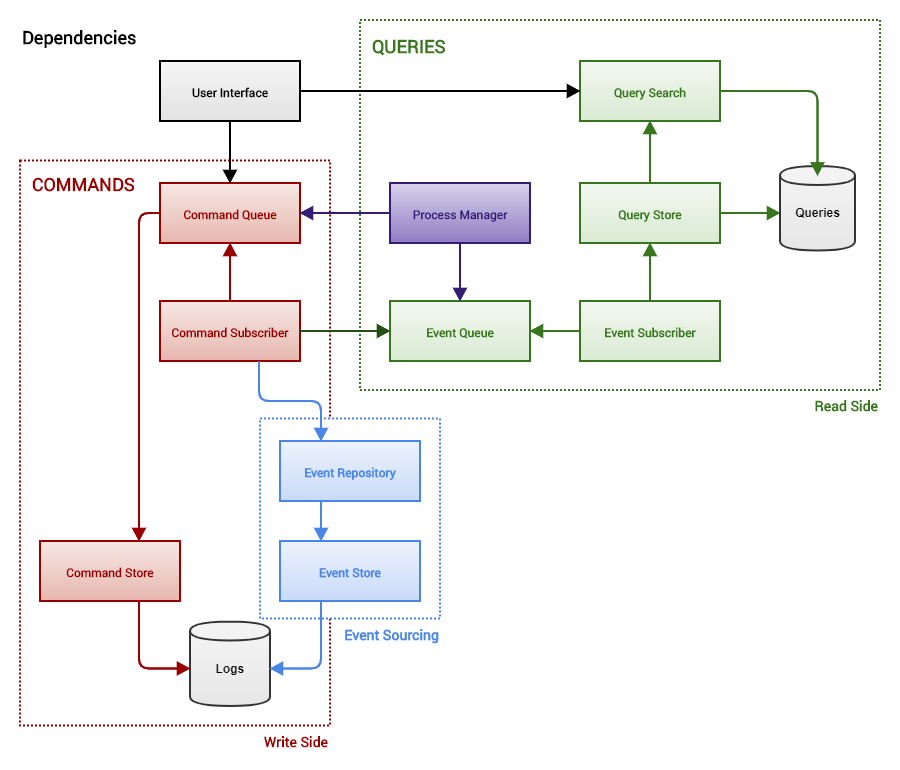

Notice the Write Side (Commands) and Read Side (Queries) are well-delineated.

You can also see that Event Sourcing is very much like a plug-in to the Write Side. Although it is not demonstrated in this solution, you can see how a CQRS solution _without_ Event Sourcing might look, and sometimes that (CQRS-alone) is a better pattern, depending on the requirements for your project.

Here are the key characteristics of the architecture:

-   The command queue saves commands (required for scheduling) in a structured log.
-   A command subscriber listens for commands on the command queue.
-   A command subscriber is responsible for creating an aggregate and invoking methods on an aggregate when commands are executed.
-   A command subscriber saves an aggregate (as an event stream) in a structured log.
-   A command subscriber publishes events on the event queue.
-   Published events are handled by event subscribers and process managers.
-   A process manager can send commands on the command queue, in response to events.
-   An event subscriber creates and updates projections in a query store.
-   A query search is a lightweight data access layer for reading projections.

## Getting Started

Before you compile and execute the source code:

1.  Execute the script "Create Database.sql" to create a local SQL Server database.
2.  Update the connection string in _Web.config_.
3.  Update the appSetting value in _Web.config_ for OfflineStoragePath.

### Usage

Rather than start at the bottom, and describe how the Timeline assembly works, I will start at the top and demonstrate how to use it, then work my way down through the application stack to the nuts and bolts of the CQRS+ES backbone.

If I have held your attention this long, then I owe you more than a little reward for staying with me thus far...

### Scenario A: How to Create and Update a Contact

This is the simplest possible usage.

Here we create a new contact person, then perform a name-change, simulating a use case in which Alice gets married:

```
public static void Run(ICommandQueue commander)
{
    var alice = Guid.NewGuid();
    commander.Send(new RegisterPerson(alice, "Alice", "O'Wonderland"));
    commander.Send(new RenamePerson(alice, "Alice", "Cooper"));
}
```

Following this run the read-side projection looks good, just as expected:

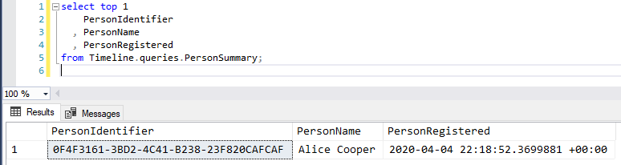

### Data Flow

The steps performed by the system in this scenario are illustrated in the following diagram:

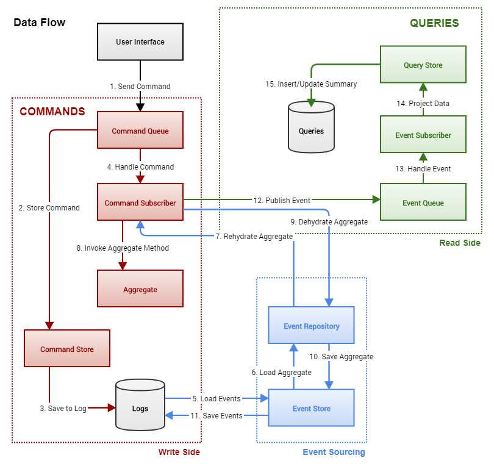

### Scenario B: How to Take a Snapshot of an Aggregate

Snapshots are automated by the Timeline assembly; they are enabled for every aggregate by default, so you don't have to do anything at all to get this working.

In this next test run, the Timeline assembly is configured to take a snapshot after every 10 events. We register a new contact person, then rename him 20 times. This produces a snapshot on event number 20, which is the second-to-last rename operation.

```
public static void Run(ICommandQueue commander)
{
    var henry = Guid.NewGuid();
    commander.Send(new RegisterPerson(henry, "King", "Henry I"));
    for (int i = 1; i <= 20; i++)
        commander.Send(new RenamePerson(henry, "King", "Henry " + (i+1).ToRoman()));
}
```

As expected, we have a snapshot at version 20, and the current-state projection after event number 21:

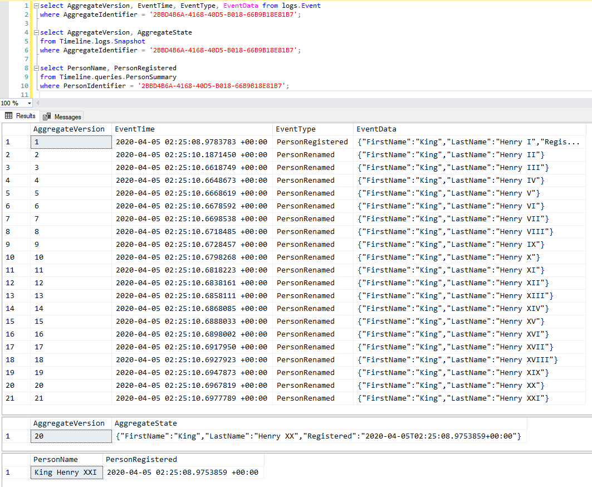

### Scenario C: How to Take an Aggregate Offline

In my solution the terms "boxing" and "unboxing" are used for taking an aggregate offline and bringing it back online.

When you send a command to **box** an aggregate, the Timeline assembly:

1.  creates a snapshot; then
2.  copies that snapshot and the entire aggregate event stream to a JSON file stored in a directory on the file system; then
3.  deletes the snapshot and the aggregate from the SQL Server structured log tables.

This makes it a highly destructive operation, of course, and it should never be used except in circumstances where it is a mandatory business/legal requirement.

In the next test run, we register a new contact person, rename him 7 times, then box the aggregate.

```
public static void Run(ICommandQueue commander)
{
    var hatter = Guid.NewGuid();
    commander.Send(new RegisterPerson(hatter, "Mad", "Hatter One"));
    for (int i = 2; i <= 8; i++)
        commander.Send(new RenamePerson(hatter, "Mad", "Hatter " + i.ToWords().Titleize()));
    commander.Send(new BoxPerson(hatter));
}
```

As you can see, the aggregate no longer exists in the event store, and an offline copy of the final snapshot (along with the entire event stream) has been made on the file system.

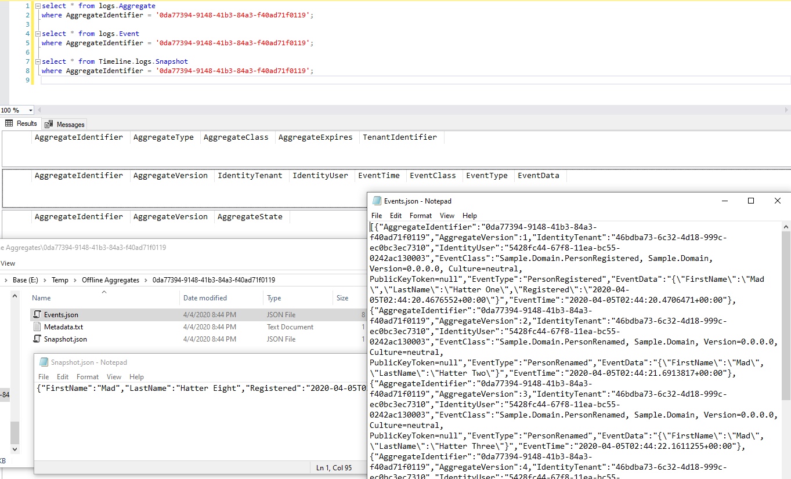

### Scenario D: How to Create a New User With a Unique Login Name

The question I encounter most frequently online from developers trying to understand CQRS+ES is this:

> "How do I enforce referential integrity to guarantee new users have unique login names?"

I asked this same question myself (more than once) in the early days of my research on the CQRS+ES pattern.

A lot of the answers from experienced practitioners look something like this:

> "Your question indicates you do not understand CQRS+ES."

This is true (I realize now) but completely unhelpful, especially to someone who is making an effort to learn.

Some of the answers are slightly better, offering a high-level recommendation in summary form, but loaded with CQRS+ES terminology, which is not always helpful either. One of my favorite recommendations was this (from the good folks at [Edument](https://cqrs.nu/Faq)):

> "Create a reactive saga to flag down and inactivate accounts that were nevertheless created with a duplicate user name, whether by extreme coincidence or maliciously or because of a faulty client."

The first time I read that I had only a vague sense of what it meant, and no idea at all how to begin to implement such a recommendation.

The next test run shows one way (but not the only way) to create a new user with a unique name, using real, working code as an example.

In this scenario, the trick is to realize that you do in fact need a _saga_ (or _process manager_, as I prefer to call it). Creating a new user account is not a single-step operation; it is a process, and therefore requires coordination. The flowchart (or _state machine_, if you prefer) might be very complex in your application, but even in the simplest of all possible cases, it looks something like this:

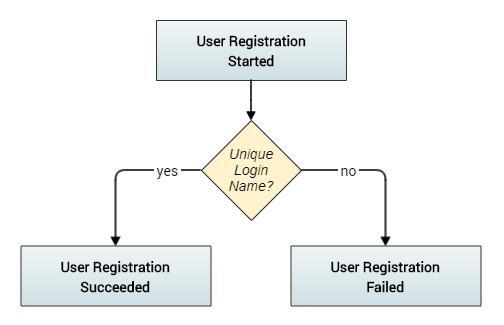

The code that relies on a process manager to implement this functionality is shown in the next figure:

```
public void Run()
{
    var login = "jack@example.com";
    var password = "Let_Me_In!";

    if (RegisterUser(Guid.NewGuid(), login, password)) // succeeds.
        System.Console.WriteLine($"User registration for {login} succeeded");

    if (!RegisterUser(Guid.NewGuid(), login, password)) // fails; duplicate login.
        System.Console.WriteLine($"User registration for {login} failed");
}

private bool RegisterUser(Guid id, string login, string password)
{
    bool isComplete(Guid user) { return _querySearch.IsUserRegistrationCompleted(user); }
    const int waitTime = 200; // ms
    const int maximumRetries = 15; // 15 retries (~3 seconds)

    _commander.Send(new StartUserRegistration(id, login, password));

    for (var retry = 0; retry < maximumRetries && !isComplete(id); retry++)
        Thread.Sleep(waitTime);

    if (isComplete(id))
    {
        var summary = _querySearch.SelectUserSummary(id);
        return summary?.UserRegistrationStatus == "Succeeded";
    }
    else
    {
        var error = $"Registration for {login} has not completed after
                    {waitTime * maximumRetries} ms";
        throw new IncompleteUserRegistrationException(error);
    }
}
```

Notice the caller in the example above does not assume synchronous handling of the command StartUserRegistration. Instead, it polls the status of the registration, waiting for it to complete.

Knowing the code in the Timeline assembly is **synchronous**, we can refactor the method RegisterUser so it is even simpler:

```
private bool RegisterUserNoWait(Guid id, string login, string password)
{
    bool isComplete(Guid user) { return _querySearch.IsUserRegistrationCompleted(user); }

    _commander.Send(new StartUserRegistration(id, login, password));

    Debug.Assert(isComplete(id));

    return _querySearch.SelectUserSummary(id).UserRegistrationStatus == "Succeeded";
}
```

The code for the process manager itself is simpler than you might guess:

```
public class UserRegistrationProcessManager
{
    private readonly ICommandQueue _commander;
    private readonly IQuerySearch _querySearch;

    public UserRegistrationProcessManager
       (ICommandQueue commander, IEventQueue publisher, IQuerySearch querySearch)
    {
        _commander = commander;
        _querySearch = querySearch;

        publisher.Subscribe<UserRegistrationStarted>(Handle);
        publisher.Subscribe<UserRegistrationSucceeded>(Handle);
        publisher.Subscribe<UserRegistrationFailed>(Handle);
    }

    public void Handle(UserRegistrationStarted e)
    {
        // Registration succeeds only if no other user has the same login name.
        var status = _querySearch
            .UserExists(u => u.LoginName == e.Name
			    && u.UserIdentifier != e.AggregateIdentifier)
            ? "Failed" : "Succeeded";

        _commander.Send(new CompleteUserRegistration(e.AggregateIdentifier, status));
    }

    public void Handle(UserRegistrationSucceeded e) { }

    public void Handle(UserRegistrationFailed e) { }
}
```

There you have a basic, reactive saga that flags inactivate accounts created with a duplicate user name. And there was much rejoicing.

As expected, the first registration succeeds and the second fails:

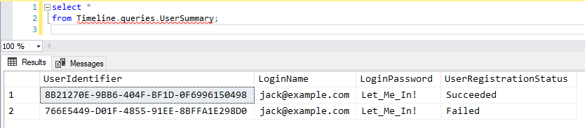

### Scenario E: How to Schedule a Command

Scheduling a command to run at a future date/time is easy:

```
public static void Run(ICommandQueue commander)
{
    var alice = Guid.NewGuid();
    var tomorrow = DateTimeOffset.UtcNow.AddDays(1);
    commander.Schedule(new RegisterPerson(alice, "Alice", "O'Wonderland"), tomorrow);

    // After the above timer elapses, any call to Ping() executes the scheduled command.
    // commander.Ping();
}
```

Notice this creates no aggregate in the event log, and the command log now contains a scheduled entry:

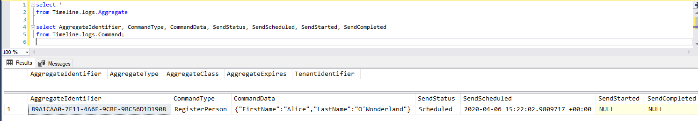

### Scenario F: How to Update Multiple Aggregates With One Command

This is another common question asked by developers who are trying to understand how to implement the CQRS+ES pattern. It is another question I asked (many, many times) when I was learning it myself.

Practitioners often answer by saying:

> "You can't."

This is not enormously helpful.

Some will offer a little more guidance with a statement that goes like this:

> "The factoring of your aggregates and command handlers will make this idea impossible to express in code."

The first several times you read that statement it seems cryptic, and in the end you discover it can be quite helpful for validating your implementation, but in the beginning it isn't super instructive.

More helpful is an example with real, working code, which implements the type of functionality that motivated the question in the first place:

-   Suppose I have two bank accounts, each of which is an aggregate root, and I want to transfer money from one account to the other. How do I achieve this using CQRS+ES?

The next test run shows one way (and not the only way) this can be done.

In this scenario, the trick is to realize you need another aggregate root - i.e., a money Transfer, which is not itself an Account - and you _also_ need a process manager to coordinate the workflow.

The simplest possible flowchart is illustrated in the next figure. (An accounting system obviously needs something more sophisticated than this.)

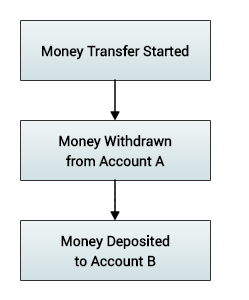

The code that relies on a process manager to implement the workflow illustrated above is easy, once you have all the pieces in place:

```
public void Run()
{
    // Start one account with $100.
    var bill = Guid.NewGuid();
    CreatePerson(bill, "Bill", "Esquire");
    var blue = Guid.NewGuid();
    StartAccount(bill, blue, "Bill's Blue Account", 100);

    // Start another account with $100.
    var ted = Guid.NewGuid();
    CreatePerson(ted, "Ted", "Logan");
    var red = Guid.NewGuid();
    StartAccount(ted, red, "Ted's Red Account", 100);

    // Create a money transfer for Bill giving money to Ted.
    var tx = Guid.NewGuid();
    _commander.Send(new StartTransfer(tx, blue, red, 69));
}

private void StartAccount(Guid person, Guid account, string code, decimal deposit)
{
    _commander.Send(new OpenAccount(account, person, code));
    _commander.Send(new DepositMoney(account, deposit));
}

private void CreatePerson(Guid person, string first, string last)
{
    _commander.Send(new RegisterPerson(person, first, last));
}
```

After that test executes, Bill's blue account has a balance of $31, and Ted's red account has a balance of $169, as expected:

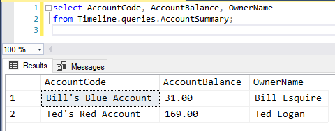

The code for the money transfer process manager is not too difficult either:

```
public class TransferProcessManager
{
    private readonly ICommandQueue _commander;
    private readonly IEventRepository _repository;

    public TransferProcessManager
    (ICommandQueue commander, IEventQueue publisher, IEventRepository repository)
    {
        _commander = commander;
        _repository = repository;

        publisher.Subscribe<TransferStarted>(Handle);
        publisher.Subscribe<MoneyDeposited>(Handle);
        publisher.Subscribe<MoneyWithdrawn>(Handle);
    }

    public void Handle(TransferStarted e)
    {
        var withdrawal = new WithdrawMoney(e.FromAccount, e.Amount, e.AggregateIdentifier);
        _commander.Send(withdrawal);
    }

    public void Handle(MoneyWithdrawn e)
    {
        if (e.Transaction == Guid.Empty)
            return;

        var status = new UpdateTransfer(e.Transaction, "Debit Succeeded");
        _commander.Send(status);

        var transfer = (Transfer) _repository.Get<TransferAggregate>(e.Transaction).State;

        var deposit = new DepositMoney(transfer.ToAccount, e.Amount, e.Transaction);
        _commander.Send(deposit);
    }

    public void Handle(MoneyDeposited e)
    {
        if (e.Transaction == Guid.Empty)
            return;

        var status = new UpdateTransfer(e.Transaction, "Credit Succeeded");
        _commander.Send(status);

        var complete = new CompleteTransfer(e.Transaction);
        _commander.Send(complete);
    }
}
```

### Scenario G: How to Implement a Custom Event Handler

In this next example, I demonstrate how to define a custom event handler that is intended for use by one and only one tenant in a multitenant system.

In this scenario, Umbrella Corporation is one of our tenants, and the organization wants all the existing core functionality in our system. However, the company also wants an additional custom feature:

-   When a money transfer is started from or to any Umbrella account, if the dollar amount exceeds $10,000, then an email notification must be sent directly to the company owner.

To satisfy this requirement, we implement a process manager for the tenant. The calling code that relies on this process manager is no different than it was in the previous scenario.

```
public void Run()
{
    // Start one account with $50,000.
    var ada = Guid.NewGuid();
    CreatePerson(ada, "Ada", "Wong");
    var a = Guid.NewGuid();
    StartAccount(ada, a, "Ada's Account", 50000);

    // Start another account with $25,000.
    var albert = Guid.NewGuid();
    CreatePerson(albert, "Albert", "Wesker");
    var b = Guid.NewGuid();
    StartAccount(albert, b, "Albert's Account", 100);

    // Create a money transfer for Ada giving money to Albert.
    var tx = Guid.NewGuid();
    _commander.Send(new StartTransfer(tx, a, b, 18000));
}

private void StartAccount(Guid person, Guid account, string code, decimal deposit)
{
    _commander.Send(new OpenAccount(account, person, code));
    _commander.Send(new DepositMoney(account, deposit));
}

private void CreatePerson(Guid person, string first, string last)
{
    _commander.Send(new RegisterPerson(person, first, last));
}
```

Here is a snapshot from the Visual Studio debugger, looking at the code for the process manager, with a breakpoint on the line that sends the email notification. Notice the body of the message in the popup is what we expect:

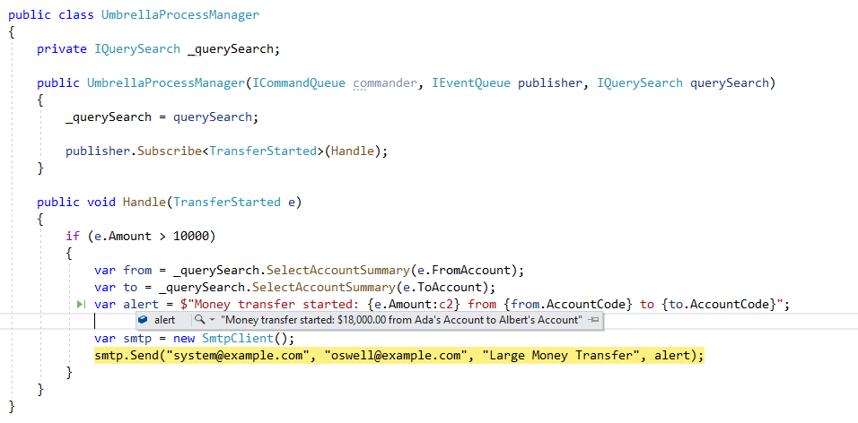

### Scenario H: How to Override a Command With a Custom Handler

This final example is a variation on the preceding one. Umbrella Corporation wants to disable a core application feature entirely, and replace it with behavior that is entirely custom. The new business requirement looks like this:

-   Changing the name of a contact person in our system is not permitted. Ever.

To satisfy this requirement, we make a few simple changes to the process manager. We add one line of code to the constructor, specifying the override, and we add the replacement function:

```
public class UmbrellaProcessManager
{
    private IQuerySearch _querySearch;

    public UmbrellaProcessManager
      (ICommandQueue commander, IEventQueue publisher, IQuerySearch querySearch)
    {
        _querySearch = querySearch;

        publisher.Subscribe<TransferStarted>(Handle);
        commander.Override<RenamePerson>(Handle, Tenants.Umbrella.Identifier);
    }

    public void Handle(TransferStarted e) { }

    public void Handle(RenamePerson c)
    {
        // Do nothing. Umbrella does not permit renaming people.

        // Throw an exception to make the consequences even more severe
		// for any attempt to rename a person...
        // throw new DisallowRenamePersonException();
    }
}
```

Here is a basic test run to demonstrate this works as expected:

```
public static class Test08
{
    public static void Run(ICommandQueue commander)
    {
        ProgramSettings.CurrentTenant = Tenants.Umbrella;

        var alice = Guid.NewGuid();
        commander.Send(new RegisterPerson(alice, "Alice", "Abernathy"));
        commander.Send(new RenamePerson(alice, "Alice", "Parks"));
    }
}
```

Notice just one event in the log, and no change to the person's name:

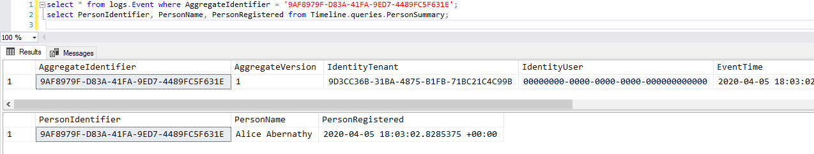

## Presentation

The presentation layer in the sample application is a console application intended only for writing and running test-case scenarios.

There is nothing here that warrants special attention. You will notice I have not used a third-party component for dependency injection; instead I have written a very basic in-memory service-locator.

This is done only for the sake of keeping the sample application as small and as focused as possible. In your own presentation layer, you'll implement dependency injection in whatever way works best for you, using whatever IoC container you prefer.

## Application

The application layer is divided into two distinct parts: a Write side for commands, and a Read side for queries. This division helps to ensure we don't accidentally mix write-side and read-side functionality.

Notice there are no references to external third-party assemblies here:

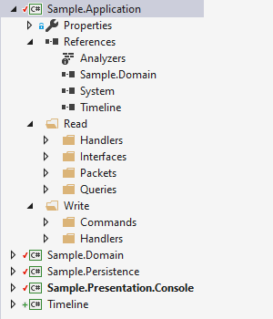

### Write Side

Commands are Plain Old C# Object (POCO) classes, so they can be easily used as Data Transfer Objects (DTOs) for easy serialization:

```
public class RenamePerson : Command
{
    public string FirstName { get; set; }
    public string LastName { get; set; }

    public RenamePerson(Guid id, string firstName, string lastName)
    {
        AggregateIdentifier = id;
        FirstName = firstName;
        LastName = lastName;
    }
}
```

> **Note**: I prefer the term "Packet" to "Data Transfer Object", and I know many readers will object to that, so choose terminology that works for you and your team.

The registration of a command handler method is **explicit** in the constructor for a command subscriber class, and events are published **after** they have been saved to the event store:

```
public class PersonCommandSubscriber
{
    private readonly IEventRepository _repository;
    private readonly IEventQueue _publisher;

    public PersonCommandSubscriber
      (ICommandQueue commander, IEventQueue publisher, IEventRepository repository)
    {
        _repository = repository;
        _publisher = publisher;

        commander.Subscribe<RegisterPerson>(Handle);
        commander.Subscribe<RenamePerson>(Handle);
    }

    private void Commit(PersonAggregate aggregate)
    {
        var changes = _repository.Save(aggregate);
        foreach (var change in changes)
            _publisher.Publish(change);
    }

    public void Handle(RegisterPerson c)
    {
        var aggregate = new PersonAggregate { AggregateIdentifier = c.AggregateIdentifier };
        aggregate.RegisterPerson(c.FirstName, c.LastName, DateTimeOffset.UtcNow);
        Commit(aggregate);
    }

    public void Handle(RenamePerson c)
    {
        var aggregate = _repository.Get<PersonAggregate>(c.AggregateIdentifier);
        aggregate.RenamePerson(c.FirstName, c.LastName);
        Commit(aggregate);
    }
}
```

### Read Side

Queries are POCO classes also, making them lightweight and easy to serialize.

```
public class PersonSummary
{
    public Guid TenantIdentifier { get; set; }

    public Guid PersonIdentifier { get; set; }
    public string PersonName { get; set; }
    public DateTimeOffset PersonRegistered { get; set; }

    public int OpenAccountCount { get; set; }
    public decimal TotalAccountBalance { get; set; }
}
```

The registration of an event handler method is also **explicit** in the constructor for an event subscriber class:

```
public class PersonEventSubscriber
{
    private readonly IQueryStore _store;

    public PersonEventSubscriber(IEventQueue queue, IQueryStore store)
    {
        _store = store;

        queue.Subscribe<PersonRegistered>(Handle);
        queue.Subscribe<PersonRenamed>(Handle);
    }

    public void Handle(PersonRegistered c)
    {
        _store.InsertPerson(c.IdentityTenant, c.AggregateIdentifier,
                            c.FirstName + " " + c.LastName, c.Registered);
    }

    public void Handle(PersonRenamed c)
    {
        _store.UpdatePersonName(c.AggregateIdentifier, c.FirstName + " " + c.LastName);
    }
}
```

## Domain

The domain contains only aggregates and events. Again, you'll see the list of References here is as bare-metal as possible:

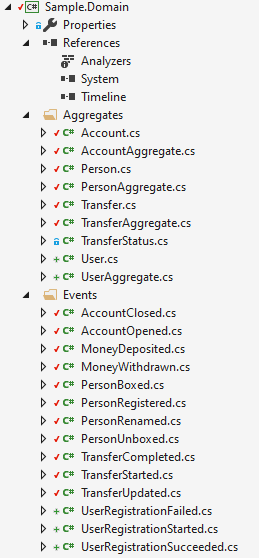

Each aggregate root class contains a function for each of the commands it accepts as a request to change its state:

```
public class PersonAggregate : AggregateRoot
{
    public override AggregateState CreateState() => new Person();

    public void RegisterPerson(string firstName, string lastName, DateTimeOffset registered)
    {
        // 1. Validate command
        // Omitted for the sake of brevity.

        // 2. Validate domain.
        // Omitted for the sake of brevity.

        // 3. Apply change to aggregate state.
        var e = new PersonRegistered(firstName, lastName, registered);
        Apply(e);
    }

    public void RenamePerson(string firstName, string lastName)
    {
        var e = new PersonRenamed(firstName, lastName);
        Apply(e);
    }
}
```

Notice the aggregate state is implemented in a class that is separate from the aggregate root.

This makes serialization and snapshots easier to manage, and it helps with overall readability because it forces a stronger delineation between command-related functions and event-related functions:

```
public class Person : AggregateState
{
    public string FirstName { get; set; }
    public string LastName { get; set; }
    public DateTimeOffset Registered { get; set; }

    public void When(PersonRegistered @event)
    {
        FirstName = @event.FirstName;
        LastName = @event.LastName;
        Registered = @event.Registered;
    }

    public void When(PersonRenamed @event)
    {
        FirstName = @event.FirstName;
        LastName = @event.LastName;
    }
}
```

Events, like commands and queries, are lightweight POCO classes:

```
public class PersonRenamed : Event
{
    public string FirstName { get; set; }
    public string LastName { get; set; }

    public PersonRenamed(string first, string last) { FirstName = first; LastName = last; }
}
```

## Persistence

At the persistence layer, we begin to see a larger number of dependencies on external third-party components. For example, here we rely on:

-   [Json.NET](http://json.net/) for JSON serialization and deserialization;
-   [System.Data](http://system.data/) for logging commands and events and snapshots in SQL Server using [ADO.NET](http://ado.net/); and
-   [Entity Framework](https://docs.microsoft.com/en-us/ef) for query projections.

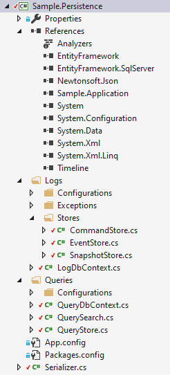

The source code in this project implements a standard run-of-the-mill data access layer, and there should be nothing in this layer that it is new, or especially innovative, or surprising to any experienced developer - so it needs no special discussion.

## CQRS+ES Backbone

And at long (_long_) last, ladies and gentlemen, comes the part of the evening you've been waiting for: the Timeline assembly that actually implements the CQRS+ES pattern, which makes all of the above possible.

The funny thing is... now that we have arrived at the nuts and bolts, there should be very little mystery remaining.

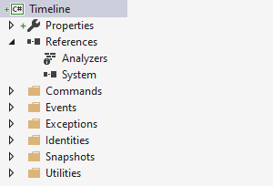

The first thing you'll notice is the Timeline assembly has **no** dependencies on external third-party components (besides the .NET Framework itself, obviously).

### Commands

There are just a few things to note here.

The Command base class contains properties for the aggregate identifier and version number, as you'd expect. It also contains properties for the identity of the tenant and user sending the command.

```
/// <summary>
/// Defines the base class for all commands.
/// </summary>
/// <remarks>
/// A command is a request to change the domain. It is always are named with a verb in
/// the imperative mood, such as Confirm Order. Unlike an event, a command is not a
/// statement of fact; it is only a request, and thus may be refused. Commands are
/// immutable because their expected usage is to be sent directly to the domain model for
/// processing. They do not need to change during their projected lifetime.
/// </remarks>
public class Command : ICommand
{
    public Guid AggregateIdentifier { get; set; }
    public int? ExpectedVersion { get; set; }

    public Guid IdentityTenant { get; set; }
    public Guid IdentityUser { get; set; }

    public Guid CommandIdentifier { get; set; }
    public Command() { CommandIdentifier = Guid.NewGuid(); }
}
```

The CommandQueue implements the ICommandQueue interface, which defines a small set of methods to register subscribers and overrides, as well as send and schedule commands. You can think of this as the [service bus](https://en.wikipedia.org/wiki/Enterprise_service_bus) for your commands.

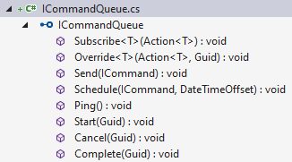

### Events

The Event base class contains properties for the aggregate identifier and version number, as well as properties for the identity of the tenant and user for whom the event was raised/published. This ensures every event log entry is associated with a specific tenant and user.

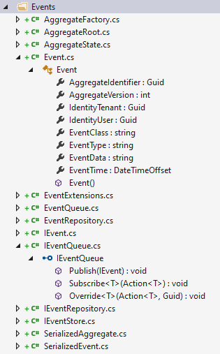

You can think of the EventQueue as the service bus for your events.

### Aggregates

There is one small bit of black magic in the AggregateState class. The Apply method uses reflection to determine which method to invoke when an event is applied to the aggregate state. I don't especially like this, but I cannot find any way to avoid it. Fortunately, the code is very easy to read and understand:

```
/// <summary>
/// Represents the state (data) of an aggregate. A derived class should be a POCO
/// (DTO/Packet) that includes a When method for each event type that changes its
/// property values. Ideally, the property values for an instance of  this class
/// should be modified only through its When methods.
/// </summary>
public abstract class AggregateState
{
    public void Apply(IEvent @event)
    {
        var when = GetType().GetMethod("When", new[] { @event.GetType() });

        if (when == null)
            throw new MethodNotFoundException(GetType(), "When", @event.GetType());

        when.Invoke(this, new object[] { @event });
    }
}
```

### Snapshots

The source code to implement Snapshots is cleaner and simpler than I imagined it could be when I first started this project. The logic is somewhat intricate, but the Snapshots namespace contains only ~240 lines of code, so I won't add details on that here. I leave that as an exercise for you, the most patient of readers, if there are any of you still left at this point. :-)

## Metrics

I will close the article with a few basic metrics. (More to come later.)

Here is the analysis report produced by [NDepend](https://www.ndepend.com/) on the Timeline assembly:

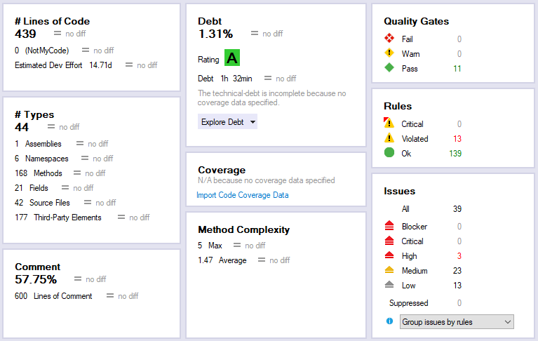

The source code is not perfect, as you can see, but does get an "A" rating, with technical debt estimated at only 1.3%. The project is also very compact, with only 439 lines of code, at the time I write this.

> **Note**: NDepend counts [lines of code (LOC)](https://www.ndepend.com/docs/code-metrics#NbLinesOfCode) from the number of sequence points per method in the .pdb symbol file for an assembly. Visual Studio counts LOC differently; on the Timeline project it reports 1,916 lines of Source code, with 277 lines of Executable code.

When time permits, I plan to update this article with run-time performance results.

## Closing Thoughts

This design and sample implementation demonstrates that building a custom CQRS+ES solution, while requiring careful consideration of trade-offs, can yield significant benefits in terms of readability, performance, and maintainability.

The project's small size, with minimal dependencies, proves that a complex architectural pattern need not be heavyweight or overly prescriptive — and by prioritizing explicit command and event handler registration, native support for multitenancy, process managers, and aggregate lifecycle management, it can establish the foundation for a solution that addresses many real-world challenges that developers encounter when implementing CQRS+ES in a production system.

Of course, none of this source code is intended as a drop-in library. It's only a prototype, intended to serve as a reference for someone embarking on their own CQRS+ES journey.

The clean architecture approach and emphasis on debuggability make this solution particularly suitable for teams that value code clarity and maintainability over framework magic, ultimately supporting the long-term evolution of enterprise systems built on event-driven architectures.

Anyone experienced with CQRS+ES implementations can tell you: it's a non-trivial pattern, and there are thousand ways to get it wrong. If you have thoughts, critiques, or questions about my approach — then please feel free to reach out!

#CQRS #EventSourcing #SoftwareArchitecture #DotNet #SoftwareDesign #EnterpriseArchitecture #DomainDrivenDesign #TechLeadership #BackendDevelopment #DeveloperCommunity
