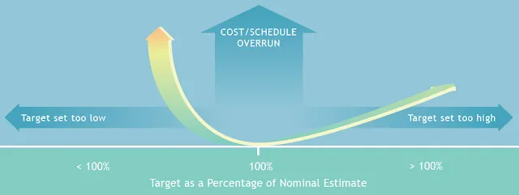

When you plan the cost and effort for a new software development project, there is often a lot of motivation (some of it good, some of it bad) to under-estimate.

The stronger the temptation seems, the more important it becomes for you to resist that temptation, because estimating too low can ruin your schedule and destroy your budget.

It's not what you'd expect, but estimating too high is an excellent way to manage and minimize risk, helping to ensure the project's success.

Here's the reason why:

Estimates at the beginning of a software project are rarely accurate, because everyone's knowledge of the project is limited. 

-   Stakeholders don't yet have a complete (or necessarily correct) understanding of business requirements for the system to be developed.
-   The project team does not yet have full and complete technical specifications.
-   Developers might not yet know everything they need to know about the domain and environment in which the solution will operate.

Building software is a process of continuous refinement and improvement. A well-run project tackles the areas of highest variability first, to eliminate uncertainties as quickly as possible. Ideally, your estimate for a software project is allowed to evolve along with the software itself.

And remember: the potential for an exponential overrun on cost and/or schedule increases the lower you set your targets.

On the other hand, when targets are set too high, even in a worst-case scenario the probability of an overrun is linear (_not exponential_). 

In other words, your risk/reward and cost/benefit ratios are much better for an over-estimate than they are for an under-estimate.

An accurate estimate is always best, of course, but an estimate that is too low can be much worse for your bottom line, so if you need to err on one side or the other, then you are better off to estimate high.

As the old saying goes, "Always hope for the best, but prepare for the worst."
